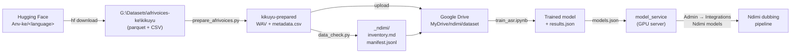

# Ndimi datasets: connect, store, use

How Ndimi gets its speech datasets, where they live, and how they become models the dubbing
pipeline can call. Read this before downloading anything.

> **In one line:** get access on Hugging Face → download one language to a big local drive
> (never into Git) → run `prepare_afrivoices.py` → run `data_check.py` → train in Colab →
> serve with `model_service` → switch it on in Ndimi Admin.

**Status (Sept 2026):** we have access to the `Anv-ke` repos (Gĩkũyũ confirmed).



---

## Contents

1. [What we have](#1-what-we-have)
2. [Get access](#2-get-access)
3. [Where datasets live](#3-where-datasets-live)
4. [Download](#4-download)
5. [Take stock with data_check](#5-take-stock-with-data_check)
6. [Use the data](#6-use-the-data)
7. [Reference: manifest.jsonl](#7-reference-manifestjsonl)
8. [Adding another dataset](#8-adding-another-dataset)
9. [Troubleshooting](#9-troubleshooting)
10. [Rules we don't break](#10-rules-we-dont-break)

---

## 1. What we have

**AfriVoices-KE** (published on Hugging Face as *African Next Voices – Kenya*): scripted and
unscripted speech across agriculture, health, finance and government topics, with transcripts,
translations, dialect labels and speaker IDs.

| Language | Ndimi code | Hugging Face repo | Published hours* | ElevenLabs covers it? |
|---|---|---|---:|---|
| Gĩkũyũ | `ki` | `Anv-ke/kikuyu` (215 GB, 173,653 clips) | ~754 | Dubbing yes, TTS no |
| Dholuo | `luo` | `Anv-ke/Dholuo` (~200 GB) | ~723 | No, **our models are the only route** |
| Kalenjin | `kln` | `Anv-ke/Kalenjin` | ~521 | No, **our models are the only route** |
| Maa | `mas` | `Anv-ke/Maasai` | ~505 | No, **our models are the only route** |
| Somali | `so` | `Anv-ke/Somali` | ~502 | TTS yes, Dubbing v2 no |

\*From the dataset card. Your own `inventory.md` (step 5) is the number to trust.

### How each repo is laid out

```
Anv-ke/kikuyu/
├── train/ · dev/ · dev_test/            official speaker-disjoint splits
│   ├── scripted/                        read-aloud prompts
│   │   ├── audios/train_scripted_000.parquet …   ~750 MB each; audio + filename, type,
│   │   │                                          split, recorder_uuid (speaker) …
│   │   └── files/transcripts.csv                  transcripts, joined on the file name
│   │       files/meta.csv                         small summary
│   └── unscripted/                      spontaneous speech (same layout, most of the hours)
```

Audio and transcripts live in **different files**, so `ml/prepare_afrivoices.py` joins them
before anything else runs (step 5).

Where it's published:

The same data also exists as one combined gated repo,
[`MCAA1-MSU/anv_data_ke`](https://huggingface.co/datasets/MCAA1-MSU/anv_data_ke). We use the
per-language [`Anv-ke`](https://huggingface.co/Anv-ke) repos. The official `test` split is held
back by the consortium for public leaderboards; we use `dev_test` as our test set.

**Licence:** CC BY 4.0 (credit the AfriVoices-KE authors wherever we describe models trained on it).
The terms forbid use for surveillance, discrimination, exploitation or profiling. Also check
the agreement from the research consortium: it may add conditions on top of the card.

---

## 2. Get access

Do this once per person who will download data.

1. **Hugging Face account.** Sign in at huggingface.co with a Jeota Media email.
2. **Request access.** Open the dataset repo (table above), fill in name and institution
   (*Jeota Media Limited*), accept the terms. Wait for the approval email if it's gated.
3. **Create a read token.** huggingface.co → Settings → Access Tokens → *New token* →
   type **Read**. Name it `ndimi-datasets-<your name>`.
4. **Store the token in the right places. Nowhere else.**

| Where | How | Why |
|---|---|---|
| Your computer | `pip install -U huggingface_hub` then `hf auth login` (paste the token) | Lets `hf download` work |
| Google Colab | 🔑 *Secrets* panel → add `HF_TOKEN` → toggle *Notebook access* | Colab reads it without it appearing in the notebook |
| Ndimi Admin | **Admin → Integrations → AfriVoices-KE dataset**: *Access token* = the token; *Extra config* `dataset_url` = the repo URL, `languages` = e.g. `["luo","kln","mas"]` | Team record of which repo and token we use. Stored encrypted. Nothing in Ndimi downloads data automatically; this is the reference copy |

> Never paste the token into a notebook cell, `.env` committed to Git, a chat, or a screenshot.
> If it leaks: delete it on Hugging Face and make a new one.

---

## 3. Where datasets live

Datasets are big and licensed, so they never travel with the code.

| Location | What goes there | What never goes there |
|---|---|---|
| `G:\Datasets\<dataset>\` (local, outside the repo) | **The full downloaded dataset** | — |
| `ml/data/` in the repo | Small samples for testing only (a few hundred clips) | Full datasets |
| `ml/out/` in the repo | Reports for small/sample runs | — |
| `MyDrive/ndimi/` on Google Drive | The slice being trained on, plus manifests and trained models | Anything we're not training on right now |
| GPU server `/models` | Trained models the service loads | Raw datasets |
| Git / GitHub / Vercel / Neon / R2 public buckets | — | **Audio, transcripts, manifests, models, tokens** |

`ml/data/`, `ml/out/`, `ml/models/` and `ml/model_service/models.json` are in `.gitignore`,
and the whole `ml/` folder is in `.vercelignore`, so the website deploy never includes them.

### Standard layout

```
G:\Datasets\
└── afrivoices-ke\
    ├── kikuyu\                ← as downloaded (parquet + CSV). Never edited by hand
    └── kikuyu-prepared\       ← written by prepare_afrivoices.py; this is what we train on
        ├── audio\train\scripted\*.wav …
        ├── metadata.csv
        ├── prepare_report.txt
        └── _ndimi\             ← written by data_check.py (--out)
            ├── inventory.md
            ├── inventory.json
            └── manifest.jsonl
```

`manifest.jsonl` stores audio paths **relative to** `kikuyu-prepared\`, so that one folder can be
copied to Google Drive (or anywhere) as a unit and every path still works.

**Disk space:** the WAV files take about as much room as the parquet download, so allow
**2× the download** (~450 GB for Gĩkũyũ in full). Once `kikuyu-prepared` checks out, the raw
`kikuyu\` folder can be deleted: it can always be downloaded again. Do one language at a time,
and start with a slice (next section).

---

## 4. Download

Pick a route. Route A keeps a full copy on our drive; Route B skips the upload to Drive.

### Route A: to the computer (Windows)

```powershell
pip install -U huggingface_hub
hf auth login

# First trial: the dev split only (~12 GB), enough to check everything end to end
hf download Anv-ke/kikuyu --repo-type dataset --include "dev/*" `
  --local-dir "G:\Datasets\afrivoices-ke\kikuyu"

# Then the rest. Scripted speech first: shorter, cleaner clips, fastest to a first model
hf download Anv-ke/kikuyu --repo-type dataset `
  --include "train/scripted/*" --include "dev_test/*" `
  --local-dir "G:\Datasets\afrivoices-ke\kikuyu"

# Everything (215 GB)
hf download Anv-ke/kikuyu --repo-type dataset --local-dir "G:\Datasets\afrivoices-ke\kikuyu"
```

Same pattern for the others: `Anv-ke/Dholuo` → `...\dholuo`, `Anv-ke/Kalenjin` → `...\kalenjin`,
`Anv-ke/Maasai` → `...\maasai`, `Anv-ke/Somali` → `...\somali`. Keep those folder names:
the prepare script reads the language from them.

- Interrupted? Run the same command again: it resumes and skips finished files.
- Record the version: note the commit hash from the repo's *Files and versions* tab and pass
  `--revision <hash>` on later downloads so a retrain uses exactly the same data.

### Route B: straight into Google Drive from Colab

Useful when you only want to train one language and don't want to upload from the office
connection. In a Colab cell (with the `HF_TOKEN` secret enabled):

```python
from google.colab import drive, userdata
drive.mount("/content/drive")
from huggingface_hub import snapshot_download

snapshot_download(
    "Anv-ke/kikuyu", repo_type="dataset",
    allow_patterns=["train/scripted/*", "dev/*", "dev_test/*"],
    local_dir="/content/drive/MyDrive/ndimi/raw/kikuyu",
    token=userdata.get("HF_TOKEN"),
)
```

Then run step 5 in Colab too (`!pip install pyarrow`, then the same two commands with Drive paths).

> Google Drive space: the full language won't fit a normal plan twice over (raw + prepared).
> For a first model, scripted train + dev + dev_test is plenty.

---

## 5. Prepare and take stock

Two commands, from the project folder:

```powershell
cd "G:\Brands\Jeota Media\sauti-yetu-site\sauti-yetu"
pip install pyarrow soundfile

# 1. Join audio (parquet) with transcripts (CSV) -> WAV files + metadata.csv
python ml\prepare_afrivoices.py "G:\Datasets\afrivoices-ke\kikuyu"

# 2. Measure, check and split -> inventory.md + manifest.jsonl
python ml\data_check.py "G:\Datasets\afrivoices-ke\kikuyu-prepared" --language ki `
  --out "G:\Datasets\afrivoices-ke\kikuyu-prepared\_ndimi"
```

### What `prepare_afrivoices.py` does

- Reads every `<split>/<type>/audios/*.parquet` a batch at a time (a 750 MB file never sits in memory) and writes each clip as `audio\<split>\<type>\<filename>.wav`.
- Joins each clip to its row in `files/transcripts.csv` by file name (case and `.wav` ignored).
- Writes one `metadata.csv`: audio, text, language, dialect, speaker, gender, duration, translations, split, type.
- Keeps the official splits; `dev_test` becomes `test`.
- Writes `prepare_report.txt`: the columns it found in every file, which ones it used, and how many clips matched. **Read it after the first run.**
- Safe to stop and re-run: existing WAV files are skipped.

| Option | Use when |
|---|---|
| `--splits dev` / `--types scripted` | Prepare only part of what you downloaded |
| `--max-files-per-group 1` | Quick trial: one parquet file per split/type |
| `--text-col`, `--key-col`, `--speaker-col`, `--dialect-col` | The report shows it picked the wrong column. It prefers `transcript` for text and `recorder_uuid` for speaker |
| `--language ki` | The folder isn't named after the language |

If the console warns that **fewer than half the clips got a transcript**, the file-name column
in `transcripts.csv` wasn't matched: check `prepare_report.txt` and pass `--key-col`.

### `data_check.py` options

| Option | Use when |
|---|---|
| `--language ki` | Always for a prepared AfriVoices folder |
| `--out <prepared>\_ndimi` | Always (see [Standard layout](#standard-layout)) |
| `--language luo` | The folder holds one language and has no language column or language-named folders |
| `--fast` | First look at a huge download: uses durations from the metadata instead of opening every file |
| `--workers 16` | Fast disk and many CPU cores |

### Read `inventory.md`

It opens with one row per language:

| Column | Meaning |
|---|---|
| Usable for transcription (h) | Clean clips with transcript, 0.5–30 s, language known, no duplicates |
| Sentence pairs (EN / SW) | Transcript + translation pairs, for training translation later |
| Transcription | `not enough yet` (< 5 h) · `start (fine-tune and compare)` (5–20 h) · `ready` (≥ 20 h) |
| Translation | `start` once there are ~2,000 sentence pairs |
| Voice | `candidate` when one speaker has ≥ 1 h of clean audio |

Then, per language: speakers, gender balance, dialects, clip lengths, sample rates and a
**Problems found** list. The common ones:

| Problem | What to do |
|---|---|
| Language not identified | Add `--language` or a `language:` line in the mapping |
| No transcript | Fine for voice data; excluded from transcription training |
| Longer than 30 s | Excluded; unscripted recordings may need splitting before they're usable |
| Transcript far too long for the clip | Likely misaligned; excluded automatically |
| Sample rate below 16 kHz | Still usable, but expect lower accuracy |
| Listed in metadata but audio missing | Download incomplete: re-run `hf download` |

**Check it worked:** the console prints the columns `data_check` used from `metadata.csv`
(`text=text, speaker=speaker, split=split, …`). The summary should show roughly the published
hours for what you downloaded, and the train/dev/test split should follow the official one.

---

## 6. Use the data

### 6.1 Train speech-to-text (Colab)

1. Upload the **prepared** folder (e.g. `kikuyu-prepared`, including `_ndimi/`) to Drive as
   `MyDrive/ndimi/dataset/`, or use Route B.
2. Open `ml/train_asr.ipynb` in Colab → *Runtime → Change runtime type → GPU*.
3. Edit the settings cell:

   ```python
   LANGUAGE   = "ki"
   DRIVE      = "/content/drive/MyDrive/ndimi"
   MANIFEST   = f"{DRIVE}/dataset/_ndimi/manifest.jsonl"
   AUDIO_ROOT = f"{DRIVE}/dataset"
   OUTPUT_DIR = f"{DRIVE}/models/whisper-{LANGUAGE}"
   DIALECT    = None      # or e.g. "Nandi" for one dialect
   ```

4. *Runtime → Run all.* It prints WER before and after on held-out speakers and saves the
   model plus `results.json`. If Colab disconnects, run it again; it resumes.
5. Optional: paste an ElevenLabs key to score Scribe on the same clips.

**Decision rule:** switch a language to our own model only when its WER is clearly below Scribe's
on the same test speakers.

Suggested order: **Gĩkũyũ first** (access confirmed, and ElevenLabs Scribe gives a benchmark
to beat), then **Dholuo → Kalenjin → Maa**, where there is no commercial alternative, then Somali.

### 6.2 Serve the model

1. Copy `ml/model_service/models.example.json` → `models.json` and add the model:
   ```json
   {"transcribe": {"luo": {"model": "/models/whisper-luo", "language_token": "swahili"}}}
   ```
2. Run the Docker image on a GPU host with `NDIMI_MODELS_TOKEN` set (see `ml/README.md`).
3. Open `https://<server>/health`: the language should be listed under `transcribe`.

### 6.3 Switch it on in Ndimi

1. **Admin → Integrations → Ndimi models (custom HTTP)**: base URL + the same bearer token → enable.
2. **Dubbing settings** → speech-to-text → *Ndimi models*.

> ⚠ That setting is global: every language the Ndimi pipeline transcribes goes to our service.
> Languages without a model return 422 and the job fails. Switch only when the service covers
> the languages you dub from, or add per-language routing first.

### 6.4 Later: translation and voices

- **Translation** (`inventory.md` shows `start`): fine-tune NLLB on the sentence pairs, add
  under `translate` in `models.json`.
- **Voice** (`candidate`): fine-tune a VITS/MMS voice on the top speaker's audio, add under `tts`.
  Check the consent terms cover synthesising that speaker's voice before you do.

---

## 7. Reference: manifest.jsonl

One JSON object per clip. The notebook and any future training script read only this file.

| Field | Example | Notes |
|---|---|---|
| `audio` | `audio/train/scripted/0v7tayjgc0_….wav` | Relative to the prepared folder |
| `duration` | `6.42` | Seconds |
| `text` | `Ber ahinya` | Transcript in the spoken language |
| `language` | `luo` | Ndimi code: `sw ki luo kln mas so luy mer kam guz` |
| `dialect` | `South Nyanza` | Empty if not labelled |
| `speaker` | `7f3c…` | Used for the split |
| `gender` | `female` | |
| `translation_en` / `translation_sw` | | Empty if none |
| `sample_rate` | `16000` | |
| `split` | `train` · `dev` · `test` | Speaker-disjoint (kept from the dataset if it has a split column) |
| `usable_for_asr` | `true` | Filter on this for transcription training |
| `issues` | `["low_sample_rate"]` | Codes explained in `inventory.md` |

Load it anywhere:

```python
import json
rows = [json.loads(l) for l in open("manifest.jsonl", encoding="utf-8")]
luo_train = [r for r in rows if r["language"] == "luo" and r["split"] == "train" and r["usable_for_asr"]]
```

---

## 8. Adding another dataset

Common Voice, FLEURS, our own consented recordings, church media archives:

1. **Licence first:** commercial use? publishing or selling trained models? attribution? storage location?
2. Download to `G:\Datasets\<name>\` (same rules as above).
3. Run `data_check.py` with `--out G:\Datasets\<name>\_ndimi`. It understands CSV/TSV,
   JSON/JSONL, Hugging Face parquet, one `.txt` per clip and one folder per language.
4. If columns aren't picked up, copy `ml/mapping.example.yaml` to `ml/mapping.<name>.yaml`
   and fill in the names shown in `inventory.md`. Commit the mapping (it has no data in it).
5. Add a row to [What we have](#1-what-we-have) in this file.
6. To train on two datasets together, run `data_check.py` on a parent folder that contains both.

---

## 9. Troubleshooting

| Symptom | Cause | Fix |
|---|---|---|
| `403` / `GatedRepoError` on download | Access not approved yet, or logged in with another account | Check the repo page shows *You have been granted access*; `hf auth whoami` |
| `Skipping … install pandas + pyarrow` | Parquet support missing | `pip install pandas pyarrow` |
| Everything in language `unknown` | Folders not named by language and no language column | `--language <code>` |
| Clips show duration `not measured` | Can't decode the format | Install ffmpeg or `pip install soundfile` |
| Notebook: *N audio files not found under AUDIO_ROOT* | `AUDIO_ROOT` isn't the folder `data_check` scanned | Point it at the prepared folder (the one that contains `_ndimi/`) |
| `This needs pyarrow` | Parquet reader missing | `pip install pyarrow` |
| Few clips got a transcript | File-name column in `transcripts.csv` not matched | See `prepare_report.txt`, pass `--key-col` |
| Notebook: *Too few speakers for a speaker-based split* | Speaker column not mapped | Check the mapping and re-run `data_check` |
| Colab runs out of GPU memory | Batch too big | `BATCH_SIZE = 8`, or `whisper-base` |
| Drive full | Whole language uploaded | Keep a subset of shards; delete `checkpoints/` after saving the final model |

---

## 10. Rules we don't break

- Datasets, manifests, models and tokens **never** go into Git, Vercel, Neon or a public bucket.
- The downloaded folder is **read-only** to us: fixes go in the mapping or in code, never by editing files.
- Every model we ship has a `results.json` showing it beat what it replaces on the same test speakers.
- We credit AfriVoices-KE and respect its prohibited uses and any consortium terms.
- Speakers' voices are only synthesised where their consent covers it.
